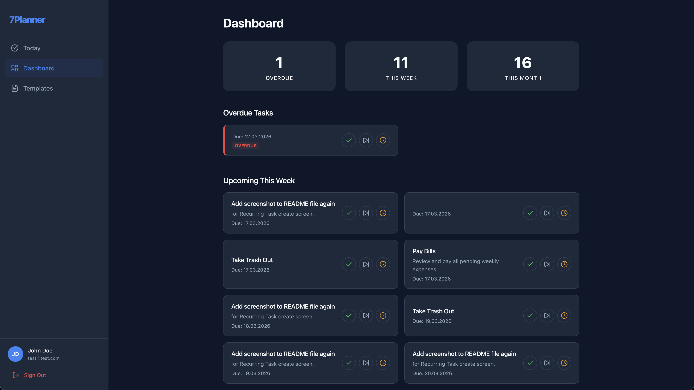
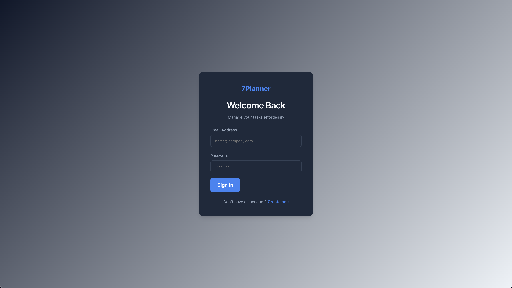
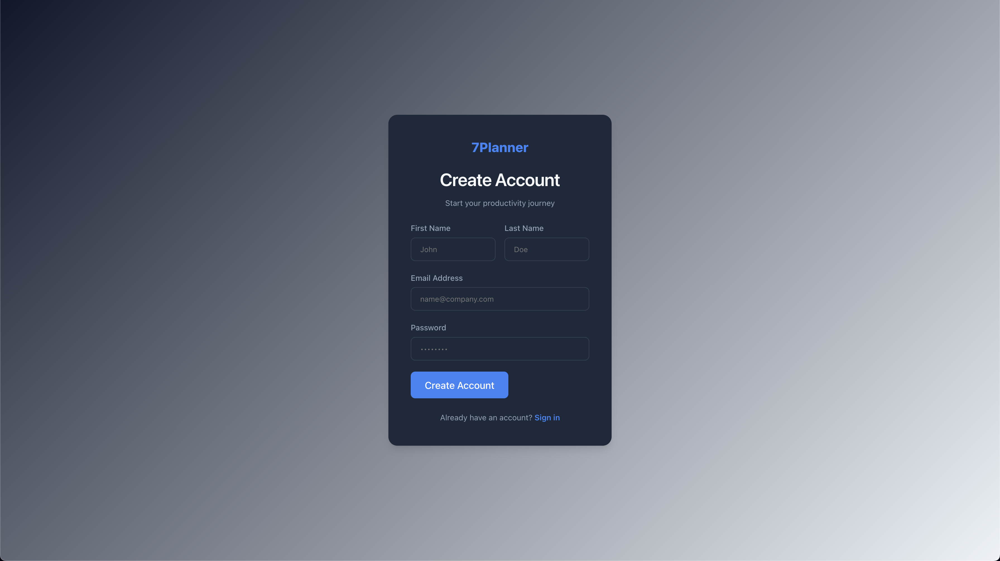
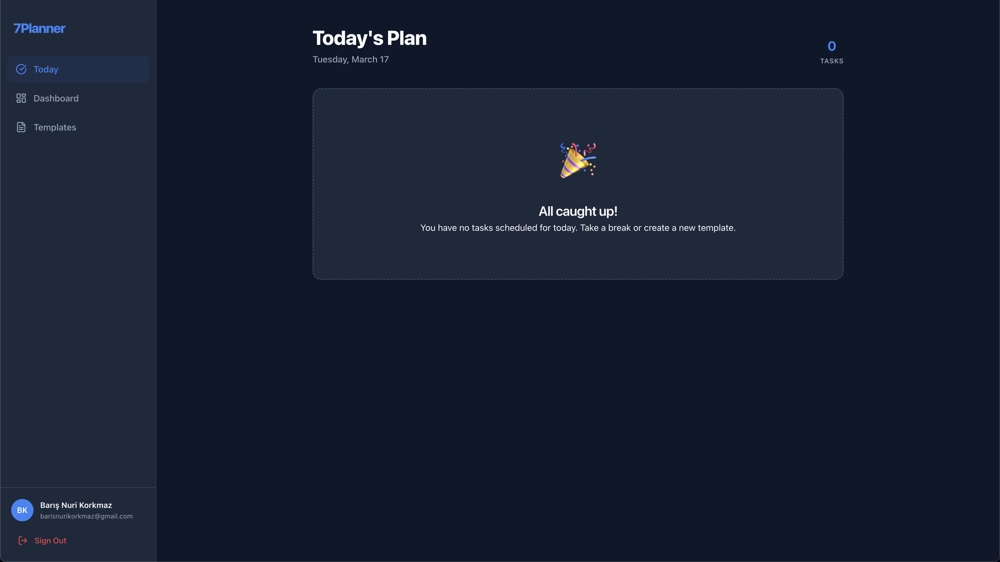
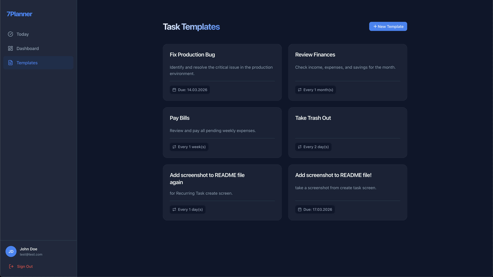
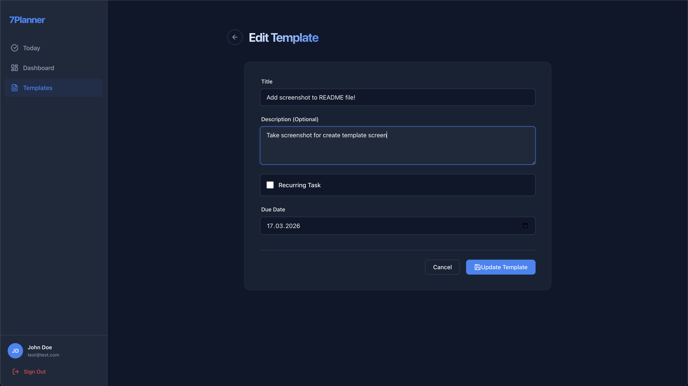
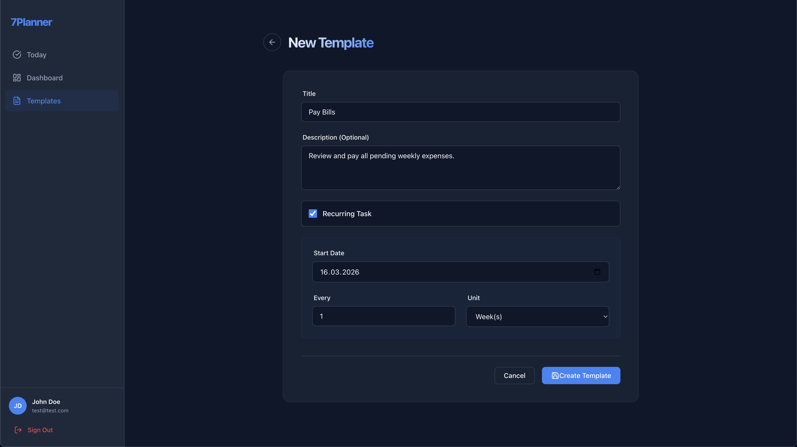

# Task Manager API

A minimalist task management backend built with **Go, Fiber and GORM**.  
This API allows users to create **one-shot or repeatable tasks**, automatically generate task occurrences, and manage their completion lifecycle.

The project is designed as an **MVP backend** for a productivity / task planner application.

---

# Screenshots

<div align="center">
  <h3>Main Dashboard</h3>
  
  
  <br>

  <table width="100%">
    <tr>
      <td width="33%" align="center"><b>Login</b><br></td>
      <td width="33%" align="center"><b>Register</b><br></td>
      <td width="33%" align="center"><b>Today View</b><br></td>
    </tr>
    <tr>
      <td width="33%" align="center"><b>Templates</b><br></td>
      <td width="33%" align="center"><b>Create Task</b><br></td>
      <td width="33%" align="center"><b>Recurring Task</b><br></td>
    </tr>
  </table>
</div>
---

# Features

### Authentication
- User registration
- User login
- JWT authentication
- Current user endpoint (`/auth/me`)

### Task Templates
Users create tasks as **templates**.

Supported types:
- One-shot tasks
- Repeatable tasks (daily / weekly / monthly)

Features:
- Create task templates
- List user templates
- Template detail
- Update template
- Activate / deactivate template

---

### Task Occurrences
Repeatable tasks automatically generate **occurrences** based on their schedule.

Supported actions:
- Complete task
- Undo completion
- Skip task
- Reschedule task

---

### Dashboard
Endpoints to fetch aggregated task data.

- Overdue tasks
- Tasks due today
- Tasks due this week
- Tasks due this month

---

### Today View
Dedicated endpoint to fetch:

- Today's tasks
- Overdue tasks
- Task counts

Designed for fast loading of the **main app screen**.

---

### System
- Health check endpoint
- Batch occurrence generation
- Duplicate protection with DB unique indexes

---

# Tech Stack

- **Go**
- **Fiber**
- **GORM**
- **PostgreSQL**
- **JWT Authentication**

---

# Architecture Overview

The system is based on a **template → occurrence model**.

```
TaskTemplate
      ↓
Occurrence Generator
      ↓
TaskOccurrence
      ↓
User Actions (complete / skip / reschedule)
```

This approach allows efficient handling of **repeatable tasks** without generating infinite records.

---

# API Endpoints

## Health

```
GET /health
```

---

## Auth

```
POST /auth/register
POST /auth/login
GET  /auth/me
```

---

## Task Templates

```
POST   /api/tasks/templates
GET    /api/tasks/templates
GET    /api/tasks/templates/:id
PATCH  /api/tasks/templates/:id
PATCH  /api/tasks/templates/:id/status
```

---

## Dashboard

```
GET /api/dashboard
```

---

## Today

```
GET /api/tasks/today
```

---

## Occurrences

```
PATCH /api/tasks/occurrences/:id/status
```

---

# Example Flow

1. Register a user  
2. Login and receive JWT token  
3. Create task template  
4. Occurrences are generated automatically  
5. Fetch today's tasks  
6. Complete / skip / reschedule tasks  

---

# Future Improvements

Possible v2 features:

- Task categories
- Task priorities
- Notifications / reminders
- Task history
- Analytics
- Team / shared tasks

---

# License

This project is intended for learning and portfolio purposes.