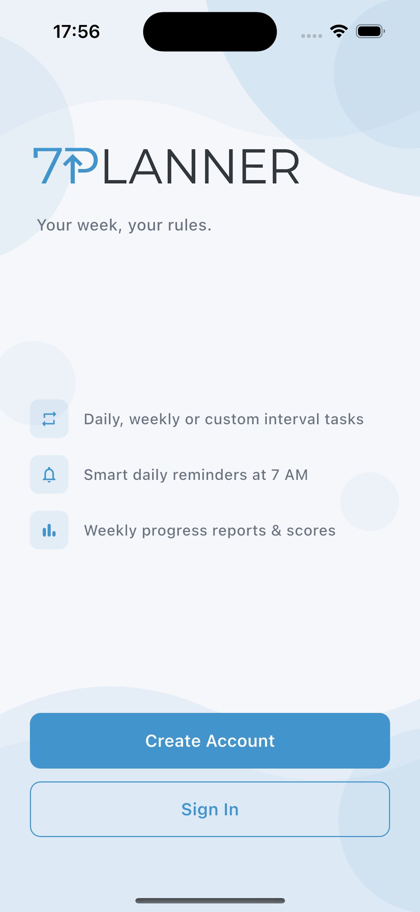
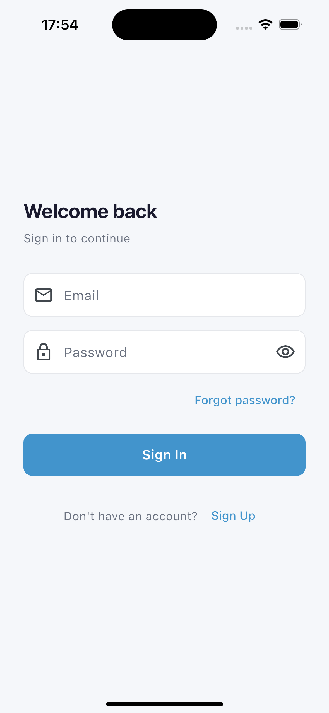
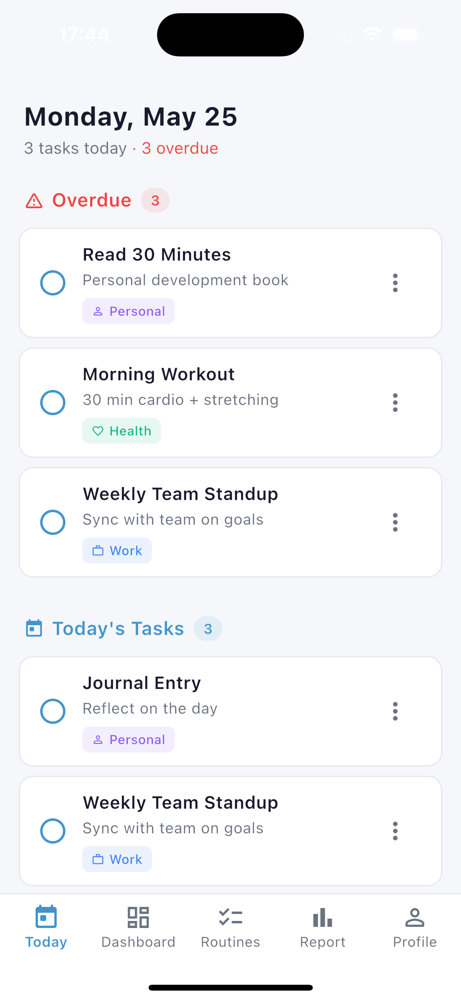
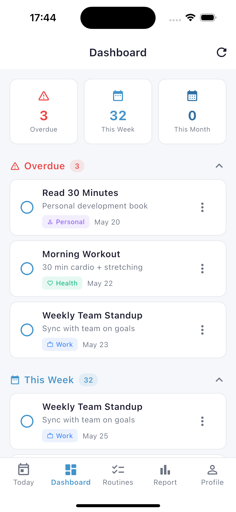
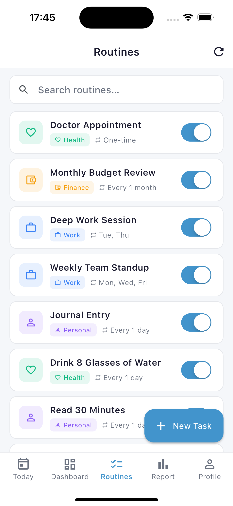
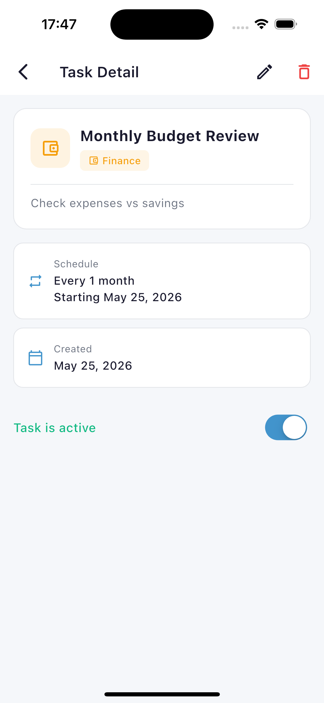
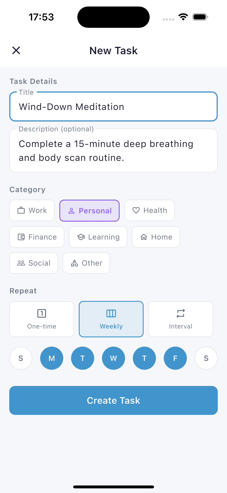
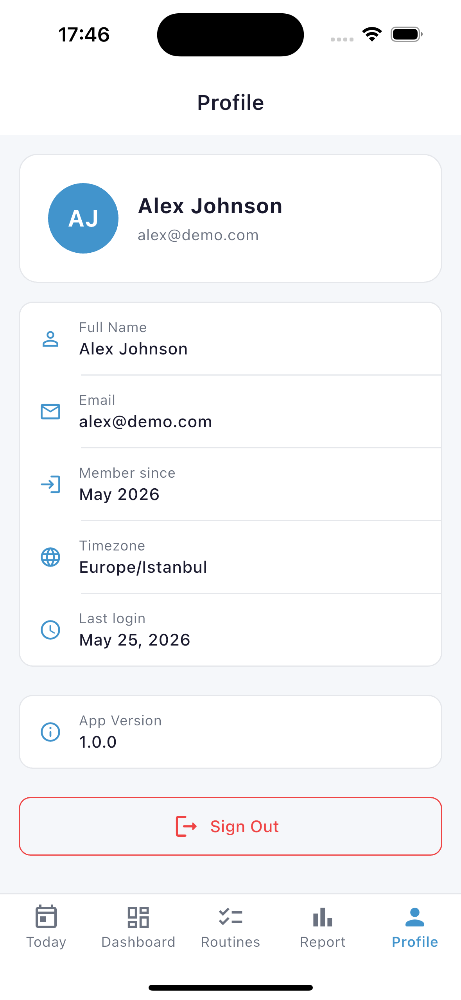

# 7Planner

Kişisel portföy projesi olarak geliştirilen, tam kapsamlı bir alışkanlık ve rutin takip uygulaması. 7Planner; kullanıcıların günlük, haftalık veya özel aralıklarla tekrarlanan rutinler tanımlamasına, tamamlanma geçmişini takip etmesine, haftalık performans raporu almasına ve günlük push bildirimleri almasına olanak tanır.

---

## Ekran Görüntüleri

<div align="center">
  <table>
    <tr>
      <td align="center"><b>Karşılama</b><br></td>
      <td align="center"><b>Giriş</b><br></td>
      <td align="center"><b>Bugün</b><br></td>
      <td align="center"><b>Gösterge Paneli</b><br></td>
    </tr>
    <tr>
      <td align="center"><b>Rutinler</b><br></td>
      <td align="center"><b>Rutin Detayı</b><br></td>
      <td align="center"><b>Rutin Oluştur</b><br></td>
      <td align="center"><b>Profil</b><br></td>
    </tr>
  </table>
</div>

---

## Özellikler

- **Esnek tekrarlama** — rutinler günlük, belirli hafta günlerinde veya özel aralıklarla (her N gün/hafta/ay) tekrarlanır
- **Günlük görev akışı** — görev gerçekleşimleri otomatik oluşturulur; bireysel olarak tamamlanabilir, atlanabilir veya yeniden planlanabilir
- **Haftalık performans raporu** — tamamlanma oranı, seriler, zamanında vs. geç tamamlamalar, atlanan görevler
- **Push bildirimleri** — Firebase Cloud Messaging üzerinden her sabah 07:00'de günlük hatırlatma ve haftalık rapor bildirimi
- **Deep link ile şifre sıfırlama** — şifremi unuttum akışı, `sevenplanner://` deep link'i ile doğrudan uygulamadaki sıfırlama ekranını açar
- **Kategori etiketleme** — iş, sağlık, kişisel, finans, öğrenme, ev, sosyal, diğer
- **Saat dilimi desteği** — kayıt sırasında kullanıcının saat dilimi alınır ve görev oluşturmada kullanılır
- **Refresh token'lı JWT kimlik doğrulama** — 15 dakikalık access token + sunucu taraflı oturum tablosunda saklanan uzun ömürlü refresh token
- **Rate limiting** — giriş endpoint'i hem e-posta hem de IP bazında hız sınırlamasına tabidir

---

## Teknoloji Yığını

### Backend — `server/`

| Katman | Teknoloji |
|---|---|
| Dil | Go 1.25 |
| Framework | Fiber v3 |
| Veritabanı | PostgreSQL |
| ORM | GORM (AutoMigrate) |
| Kimlik Doğrulama | JWT (golang-jwt v5), bcrypt |
| Push Bildirim | Firebase Admin SDK (firebase.google.com/go v4) |
| Zamanlayıcı | robfig/cron v3 |
| E-posta | gomail v2 |
| Doğrulama | go-playground/validator v10 |
| Yapılandırma | godotenv |

### Mobil — `mobile/`

| Katman | Teknoloji |
|---|---|
| Framework | Flutter 3.24 / Dart 3.5 |
| State Management | Riverpod 2.6 (StateNotifier) |
| Navigasyon | go_router 14.6 |
| HTTP İstemcisi | Dio 5.7 (interceptor & cookie jar) |
| Güvenli Depolama | flutter_secure_storage |
| Push Bildirim | firebase_messaging + flutter_local_notifications |
| Deep Link | app_links 6.3 |
| Saat Dilimi Tespiti | flutter_timezone |

---

## Mimari

### Backend

```
server/
├── main.go                  # Fiber uygulama kurulumu, route tanımları, cron başlatma
├── database/
│   ├── database.go          # GORM + PostgreSQL bağlantısı
│   └── functions.go         # Ortak DB sorgu yardımcıları
├── middleware/
│   └── logger.go            # Yapılandırılmış logger (slog)
├── utils/
│   ├── validator.go         # Global validator örneği
│   ├── password.go          # bcrypt yardımcıları
│   └── mail.go              # SMTP e-posta gönderici
└── modules/
    ├── auth/
    │   ├── models.go        # User, Session, PasswordResetToken, DTO'lar
    │   ├── handlers.go      # Register, Login, Refresh, Logout, ForgotPassword, ResetPassword, Me
    │   ├── jwt.go           # Token üretimi ve doğrulaması
    │   └── middleware.go    # AccessTokenMiddleware, rate limiter'lar
    ├── task/
    │   ├── models.go        # TaskTemplate, TaskOccurrence, DTO'lar
    │   └── handlers.go      # Template CRUD, gerçekleşim üretimi, dashboard, rapor
    └── notification/
        ├── firebase.go      # Firebase uygulama başlatma, SendPushToToken
        ├── functions.go     # Günlük hatırlatma & haftalık rapor push mantığı, cron
        ├── handlers.go      # Cihaz token kayıt/silme endpoint'leri
        └── models.go        # DeviceToken modeli
```

### Mobil

```
mobile/lib/
├── main.dart                          # Firebase init, ProviderScope, uygulama girişi
├── app.dart                           # GoRouter yapılandırması, _AuthRouterNotifier, alt nav
├── core/
│   ├── api/api_client.dart            # Dio singleton, token interceptor, otomatik yenileme
│   ├── models/user.dart               # User modeli
│   ├── providers/
│   │   ├── auth_provider.dart         # AuthState + AuthNotifier
│   │   └── onboarding_provider.dart
│   ├── services/notification_service.dart  # FCM token kaydı, yerel bildirimler
│   └── theme/app_theme.dart
└── features/
    ├── auth/           # Giriş, Kayıt, Şifremi Unuttum, Şifre Sıfırlama
    ├── onboarding/     # Onboarding + Karşılama ekranları
    ├── today/          # Günlük görev akışı
    ├── dashboard/      # İstatistik özeti
    ├── templates/      # Rutin listesi, detayı, oluşturma/düzenleme
    ├── report/         # Haftalık performans raporu
    └── profile/        # Kullanıcı bilgisi, saat dilimi, çıkış
```

---

## API Referansı

Tüm route'lar `/v1` öneki ile başlar.

### Auth (herkese açık)

| Method | Path | Açıklama |
|---|---|---|
| `POST` | `/auth/register` | Hesap oluştur |
| `POST` | `/auth/login` | Giriş yap (e-posta + IP bazlı rate limit) |
| `POST` | `/auth/refresh` | Refresh token ile access token yenile |
| `POST` | `/auth/forgot-password` | Şifre sıfırlama e-postası gönder |
| `POST` | `/auth/reset-password` | Token ile şifreyi sıfırla |
| `GET` | `/health` | Sağlık kontrolü |

### Korumalı — `/u/*` (Bearer token gerekli)

| Method | Path | Açıklama |
|---|---|---|
| `GET` | `/me` | Giriş yapan kullanıcı bilgisi |
| `POST` | `/auth/logout` | Oturumu sonlandır |
| `GET` | `/tasks/today` | Bugünün gerçekleşimleri + gecikmiş görevler |
| `PATCH` | `/tasks/occurrences/:id` | Gerçekleşim güncelle: `complete`, `undo`, `skip`, `reschedule` |
| `GET` | `/templates/` | Aktif rutinleri listele |
| `POST` | `/templates/` | Rutin oluştur |
| `GET` | `/templates/:id` | Rutin detayı + gerçekleşim geçmişi |
| `PATCH` | `/templates/:id` | Rutin alanlarını güncelle |
| `PATCH` | `/templates/:id/status` | Yumuşak silme (`isActive=false`) |
| `GET` | `/dashboard` | Toplu istatistikler |
| `GET` | `/reports/weekly` | Haftalık performans raporu |
| `POST` | `/notifications/tokens` | FCM cihaz token'ı kaydet |
| `DELETE` | `/notifications/tokens` | FCM cihaz token'ı sil |

---

## Veri Modeli

### TaskTemplate

Kullanıcı tanımlı bir rutini temsil eder. Üç tekrarlama modu:

| `repeatType` | Zorunlu Alanlar | Örnek |
|---|---|---|
| `once` | `dueDate` | Son tarihi olan tek seferlik görev |
| `weekly` | `weekDays` (`"1,3,5"`) | Her Pazartesi, Çarşamba, Cuma |
| `interval` | `repeatUnit`, `repeatInterval`, `startDate` | Her 2 günde bir, her 1 ayda bir |

### TaskOccurrence

Bir template'in günlük gerçekleşim kayıtları. `(taskId, dueDate)` üzerindeki eşsiz kısıtlama tekrar oluşturmayı engeller. Durumlar: `pending`, `completed`, `skipped`.

### Session

Sunucu taraflı refresh token deposu — token SHA-256 hash olarak saklanır, asla düz metin olarak tutulmaz. Birden fazla eş zamanlı oturumu (çok cihaz) destekler.

---

## Yerel Ortamda Çalıştırma

### Backend

Gereksinimler: Go 1.21+, PostgreSQL, Firebase servis hesabı JSON dosyası

```bash
cd server
cp .env.example .env   # DB_DSN, APP_PORT, FIREBASE_CREDENTIALS_PATH, SMTP_* değerlerini doldur

go run main.go
```

### Mobil

Gereksinimler: Flutter 3.24+, Xcode (iOS) veya Android Studio (Android)

```bash
cd mobile
flutter pub get
flutter run
```

Uygulama varsayılan olarak `http://127.0.0.1:5001/v1` adresine bağlanır. Yayınlanmış bir backend için `core/api/api_client.dart` içindeki base URL'yi değiştirin.

---

## Temel Tasarım Kararları

**Talep üzerine gerçekleşim üretimi** — `TaskOccurrence` satırları toplu olarak önceden oluşturulmaz; kullanıcı bugünkü akışı açtığında veya günlük cron çalıştığında lazy olarak üretilir. Bu yaklaşım veritabanını sade tutar ve ağır bir arka plan işine gerek bırakmaz.

**Rutinler için yumuşak silme** — Bir rutinin devre dışı bırakılması satırı silmek yerine `isActive=false` yapar. Geçmiş gerçekleşimler haftalık rapor için erişilebilir kalır.

**Kısa ömürlü access token + sunucu taraflı oturumlar** — 15 dakikalık JWT'ler saldırı penceresini daraltır; refresh token'lar hash'lenerek `sessions` tablosunda saklanır, böylece çıkışta diğer cihazları etkilemeden bireysel oturumlar iptal edilebilir.

**Mobilde yerel önbellek yok** — Ekranlar her yüklenişte güncel veriyi çeker. Kullanıcı başına düşen veri hacmi (günde onlarca gerçekleşim) göz önüne alındığında, yerel bir DB katmanı veya önbellek geçersizleştirme karmaşıklığına gerek duyulmamıştır.

---

## Geliştirici

**Barış Nuri Korkmaz** — Go ve Flutter ile tam kapsamlı uygulama geliştirme pratiği yapmak amacıyla kişisel portföy projesi olarak geliştirilmiştir.

Backend tamamen elle yazılmıştır. Flutter frontend ve test fonksiyonları yapay zeka desteğiyle (Claude ve Antigravity) yazılmıştır.
